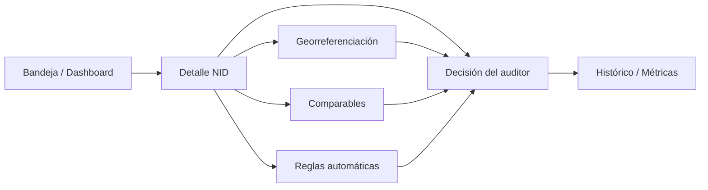

# AuditorIA Pricing — Herramienta web interna

Interfaz web para **AuditorIA Pricing**, herramienta interna de Habi/Tuhabi que centraliza los procesos de auditoría de pricing. Este repositorio contiene el **MVP del flujo Pricing Inicial**, con arquitectura preparada para operar en **Colombia 🇨🇴** y **México 🇲🇽**.

> **Estado actual:** frontend con datos mock (sin backend). Pensado para validar UX, flujos operativos y diseño antes de integrar APIs reales.

---

## Tabla de contenidos

- [Visión del producto](#visión-del-producto)
- [Alcance del MVP](#alcance-del-mvp)
- [Stack tecnológico](#stack-tecnológico)
- [Inicio rápido](#inicio-rápido)
- [Scripts disponibles](#scripts-disponibles)
- [Estructura del proyecto](#estructura-del-proyecto)
- [Rutas y pantallas](#rutas-y-pantallas)
- [Contexto operativo (país y proceso)](#contexto-operativo-país-y-proceso)
- [Datos mock](#datos-mock)
- [Flujo de auditoría por NID](#flujo-de-auditoría-por-nid)
- [Componentes clave](#componentes-clave)
- [Mapas y georreferenciación](#mapas-y-georreferenciación)
- [Convenciones de UI](#convenciones-de-ui)
- [Roadmap](#roadmap)
- [Contribución](#contribución)

---

## Visión del producto

**AuditorIA Pricing** busca centralizar varios procesos de auditoría:

| Proceso | Estado en la app |
|---|---|
| **Pricing Inicial** | ✅ Activo (MVP) |
| Pricing Comité | 🔜 Próximamente |
| Revisión de documentos | 🔜 Próximamente |
| Aprobaciones | 🔜 Próximamente |

La herramienta permite a los auditores revisar casos por NID, validar georreferenciación, comparables, reglas automáticas y tomar decisiones operativas con trazabilidad.

---

## Alcance del MVP

- Selector de **país** (Colombia / México) con datos mock distintos por mercado.
- Selector de **proceso operativo** (solo Pricing Inicial habilitado).
- **Dashboard** con KPIs, errores frecuentes, distribución por ciudad, carga por auditor y NIDs con alerta.
- **Bandeja de tareas** (Mis tareas / Bandeja general) con filtros.
- **Detalle de NID** con sub-navegación: georef, comparables, reglas y decisión.
- **Histórico**, **métricas por auditor**, **administración de reglas**, **búsqueda** y **configuración**.
- Branding dinámico: **Habi** (CO) / **Tuhabi** (MX).

---

## Stack tecnológico

| Capa | Tecnología |
|---|---|
| Framework | React 19 + TypeScript |
| Build | Vite 8 |
| Estilos | Tailwind CSS 4 |
| Routing | React Router 7 |
| Gráficos | Recharts |
| Mapas | Leaflet + OpenStreetMap |
| Iconos | Lucide React |
| Lint | Oxlint |

---

## Inicio rápido

### Requisitos

- **Node.js** 20+ (recomendado LTS)
- **npm** 10+

### Instalación

```bash
git clone https://github.com/juanmedina-Habi/auditoria-herramienta-app.git
cd auditoria-herramienta-app
npm install
npm run dev
```

Abre [http://localhost:5173](http://localhost:5173) en el navegador.

### Build de producción

```bash
npm run build
npm run preview
```

---

## Scripts disponibles

| Comando | Descripción |
|---|---|
| `npm run dev` | Servidor de desarrollo con hot reload |
| `npm run build` | Compilación TypeScript + bundle de producción |
| `npm run preview` | Sirve el build localmente |
| `npm run lint` | Ejecuta Oxlint sobre el código |

---

## Estructura del proyecto

```
auditoria-herramienta-app/
├── public/                 # Favicons y assets estáticos
├── src/
│   ├── app/                # App root y definición de rutas
│   ├── assets/             # Logos Habi / Tuhabi
│   ├── components/
│   │   ├── layout/         # AppShell, Sidebar, Topbar, selectores
│   │   ├── map/            # PropertyMap (Leaflet)
│   │   ├── nid/            # CaseHeaderBar, ValidationCards, NidPageShell
│   │   ├── tables/         # DataTable reutilizable
│   │   └── ui/             # Button, Card, MetricCard, PageHeader, etc.
│   ├── context/
│   │   └── AuditContext.tsx   # País + proceso + datos derivados
│   ├── data/               # Mocks: casos, comparables, reglas, métricas
│   ├── features/           # Páginas por dominio funcional
│   ├── services/
│   │   └── auditService.ts # Capa de acceso a datos (mock hoy)
│   ├── styles/
│   │   └── globals.css     # Tokens Tailwind y estilos base
│   └── types/
│       └── audit.ts        # Tipos compartidos del dominio
├── index.html
├── package.json
├── vite.config.ts
└── README.md
```

---

## Rutas y pantallas

| Ruta | Pantalla | Descripción |
|---|---|---|
| `/` | Dashboard | KPIs, gráficos y NIDs con alerta |
| `/tasks` | Mis tareas / Bandeja | Casos pendientes con filtros |
| `/search` | Buscar NID | Búsqueda rápida por identificador |
| `/history` | Histórico | Casos auditados previamente |
| `/auditor-metrics` | Métricas | Rendimiento por auditor |
| `/rules-admin` | Reglas | Administración de reglas automáticas |
| `/settings` | Configuración | Contexto activo y auditores |
| `/nid/:nid` | Detalle NID | Vista integral del caso |
| `/nid/:nid/georeference` | Georreferenciación | Mapa y validación geográfica |
| `/nid/:nid/comparables` | Comparables | Tabla y detección de duplicados |
| `/nid/:nid/rules` | Validaciones | Motor automático de reglas |
| `/nid/:nid/decision` | Decisión | Cierre operativo del caso |

> `/inbox` redirige a `/tasks` (la bandeja general vive como tab interna).

---

## Contexto operativo (país y proceso)

El estado global vive en `AuditContext` y combina:

- **`countryCode`**: `CO` | `MX`
- **`processType`**: tipo de proceso operativo (MVP: `PRICING_INICIAL`)
- **`scope`**: `{ countryCode, processType }` — filtra todos los datos mock

Al cambiar país o proceso, la UI y los datos se actualizan automáticamente.

### Auditores por país

| País | Auditores |
|---|---|
| 🇨🇴 Colombia | Juan Pablo Medina, Nicolás Quiroga |
| 🇲🇽 México | Ocaltzin Arriaga Anaya, Raul Guillermo Rosales Farias |

El usuario activo se resuelve con `getCurrentUser(countryCode)` en `src/data/auditors.ts`.

### Branding

| País | Marca | Título documento |
|---|---|---|
| CO | Habi | Auditoria IDM |
| MX | Tuhabi | IAudit IDM |

---

## Datos mock

Los datos se generan en `src/data/mockFactory.ts` y se exponen vía `auditService.ts`:

| Archivo | Contenido |
|---|---|
| `auditCases.ts` | Casos de auditoría (generados) |
| `comparables.ts` | Comparables por NID |
| `rules.ts` | Reglas automáticas |
| `history.ts` | Histórico de auditorías |
| `metrics.ts` | Métricas y tendencias |
| `dashboardView.ts` | KPIs y vistas del dashboard por país |
| `countries.ts` | Países, flags y títulos |
| `processes.ts` | Procesos operativos y disponibilidad |

**Colombia (demo Pricing Inicial):** ciudades como Bogotá, Valle de Aburrá, Cali, Barranquilla, Cartagena y Aledaños.

La capa `auditService` abstrae el origen de datos para facilitar la migración futura a API REST / GraphQL / BigQuery.

---

## Flujo de auditoría por NID



Cada caso incluye validaciones de:

- **Georreferenciación** — ubicación, zona mediana, estado zona Habi
- **Polynator** — score del motor
- **Escalera** — nivel de escalera de pricing
- **Comparables** — cantidad, duplicados, reglas mínimas

---

## Componentes clave

| Componente | Ubicación | Rol |
|---|---|---|
| `AppShell` | `components/layout/` | Layout principal (sidebar + topbar + main) |
| `PageHeader` | `components/ui/` | Título, breadcrumbs y acciones por página |
| `CaseHeaderBar` | `components/nid/` | Metadata del caso (NID, ciudad, SLA, etc.) |
| `ValidationCards` | `components/nid/` | Resumen de validaciones automáticas |
| `NidSubNav` | `components/layout/` | Tabs del flujo NID |
| `NidPageShell` | `components/nid/` | Layout estándar para sub-páginas NID |
| `DataTable` | `components/tables/` | Tablas con modo `compact` / `dense` |
| `PropertyMap` | `components/map/` | Mapa Leaflet con marcador del inmueble |
| `MetricCard` / `Card` | `components/ui/` | Contenedores de KPIs y secciones |

---

## Mapas y georreferenciación

- **Implementado:** Leaflet + tiles de [OpenStreetMap](https://www.openstreetmap.org/) (sin API key).
- **No implementado:** Google Maps / Street View (requiere API key y configuración adicional).

Coordenadas mock por país con fallback a centros urbanos cuando faltan lat/lng.

---

## Convenciones de UI

Diseño compacto orientado a operación diaria de auditores:

- Espaciado de página: `gap-2.5` (`pageShellClass`)
- Tipografía: títulos `text-lg`, cuerpo `text-[11px]`, meta `text-[10px]`
- Iconos: `h-3.5 w-3.5`
- Cards: prop `compact` para padding reducido
- Tablas: prop `compact` activa filas densas
- Sidebar: `w-56`, gradiente morado corporativo

---

## Roadmap

### Corto plazo
- [ ] Integración con API backend (casos, comparables, reglas)
- [ ] Autenticación y roles por auditor
- [ ] Persistencia de decisiones y comentarios

### Mediano plazo
- [ ] Habilitar Pricing Comité, Revisión de documentos y Aprobaciones
- [ ] Google Maps / Street View (opcional)
- [ ] Notificaciones y SLA en tiempo real
- [ ] Exportación de reportes

### Largo plazo
- [ ] Integración BigQuery, Portal Zonas, Pricing Hub, HubSpot
- [ ] Motor de reglas configurable en producción
- [ ] Despliegue CI/CD (staging + producción)

---

## Contribución

1. Crea una rama desde `main`:
   ```bash
   git checkout -b feature/mi-cambio
   ```
2. Desarrolla y verifica:
   ```bash
   npm run lint
   npm run build
   ```
3. Commit descriptivo y pull request hacia `main`.

### Buenas prácticas

- Mantener tipos en `src/types/audit.ts` como fuente de verdad del dominio.
- Nuevos datos mock → `mockFactory.ts` + funciones en `auditService.ts`.
- Reutilizar `PageHeader`, `Card compact` y `DataTable compact` en pantallas nuevas.
- No commitear secretos (`.env`, API keys, credenciales).

---

## Licencia

Proyecto privado — uso interno Habi / Tuhabi. Consultar al equipo propietario antes de distribución externa.

---

## Contacto

Repositorio: [github.com/juanmedina-Habi/auditoria-herramienta-app](https://github.com/juanmedina-Habi/auditoria-herramienta-app)

Equipo IDM — AuditorIA Pricing
